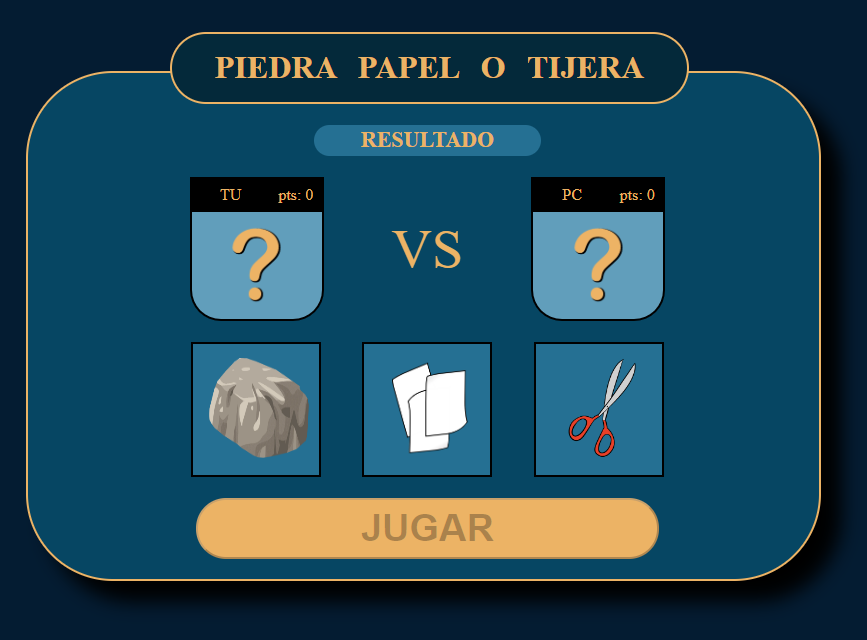

# :black_circle: :page_facing_up: :scissors: Rock-paper-scissor
## Info [:gb:]
### Description
The classical game of rock paper and scissors.   
Try to defeat the machine if you dare.

### Technologies
Javascript.  
Html.   
Css.  
Electron.   

### status
Done

### Clone Repository
~~~~
  git clone https://github.com/victorFernandezF/Rock-paper-scissors.git   
~~~~

### installation
> - Download the *exe.rar* file
> - Extract the files
> - Execute "Rock_paper_scisors.exe"
> - Enjoy

or

> - clone this repo
> - go to src directory
> - Double click index.html
> - Enjoy

### Usage
> - The user choose one object (rock, paper or scissors).   
> - The machine will choose one too.   
> - Depending on each selected items the program will evaluate the result.

### Image

### CREDITS
I got the idea from the mouredev/Code-Challenges repository:
~~~~
https://github.com/mouredev/Code-Challenges.git
~~~~

## Informacion [:es:]
### Descripción
El clásico juego de piedra papel o tijeras.   
¿Cree que podrá ganar a la máquina?

### Tecnologías usadas
Javascript.   
Html.   
Css.  
Electron.   

### Estado
Terminado.

### Clonar Repositorio
~~~~
  git clone https://github.com/victorFernandezF/Rock-paper-scissors.git   
~~~~

### instalación
> - Descargue archivo exe.rar
> - Descomprímalo
> - Ejecute "Rock_paper_scisors.exe"
> - Disfrute

or

> - clone el repositorio
> - Vaya a la carpeta "src"
> - Abra el archivo index.html
> - Disfrute

### ¿Cómo usar?
> - El usuario debe elegir entre piedra papel o tijeras.     
> - La máquina hará lo propio.
> - Dependiendo de los objetos elegidos, se evaluará el resultado.

### Imagen

### CREDITOS
La idea la he sacado del repositorio: mouredev/Code-Challenges
~~~~
https://github.com/mouredev/Code-Challenges.git
~~~~