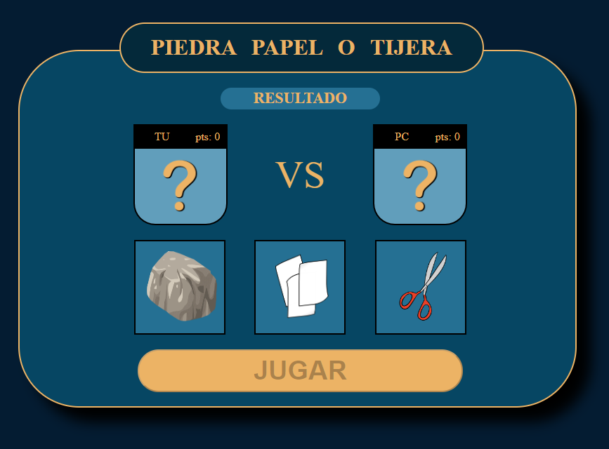

# :black_circle: :page_facing_up: :scissors: Rock-paper-scissor
## Info [:gb:]
### Description
The classical game of rock paper and scissors.   
Try to defeat the machine if you dare.

### language
Javascript.  
Html.   
Css.   

### status
In progress

### installation
> - Download the index.html
> - Open it
> - Enjoy

### Usage
> - The user choose one object (rock, paper or scissors).   
> - The machine will choose one too.   
> - Depending on each selected items the program will evaluate the result.

### Image

## Informacion [:es:]
### Descripción
El clásico juego de piedra papel o tijeras.   
¿Cree que podrá ganar a la máquina?

### lenguaje
Javascript.   
Html.   
Css.   

### Estado
Trabajando en ello.

### instalación
> - Descargue el archivo index.html
> - Haga doble click en el.
> - Disfrute.

### ¿Cómo usar?
> - El usuario deber entre piedra papel o tijeras.     
> - La máquina hará lo propio.
> - Dependiendo de los objetos elegidos, se evaluará el resultado.

### Imagen

